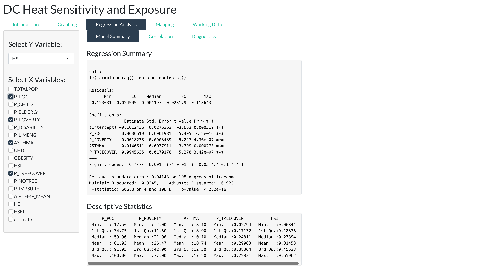

---
title: "Vignette"
output: rmarkdown::html_vignette
vignette: >
  %\VignetteIndexEntry{my-vignette}
  %\VignetteEngine{knitr::rmarkdown}
  %\VignetteEncoding{UTF-8}
---

```{r, include = FALSE}
knitr::opts_chunk$set(
  collapse = TRUE,
  comment = "#>"
)
```

### <span style="color: blue;">App Title and Authors:</span>
#### -  App Title: `DC Heat Sensitivity Mapping`

#### -  Names and course of the group members:


- Karl VonZabern - DATA 613-001
- ChihChin Yang - DATA 613-001
- SzuWei Fu - DATA 613-001
- Evan Bowman - DATA 613-001

### <span style="color: blue;">Use Case:</span>
#### - Actor Description: 

The actor for this app will most likely be someone within the DC government’s Department of Energy and Environment or Health and Human Services. The purpose of the visual representation and statistical modeling would be to assist in the formulation of policy that attempts to mitigate the occurrences of heat-related health incidences.  
 
#### - Questions of Interest: 

The use of this data frame lends itself to several questions regarding the correlates that exacerbate extreme heat and the communities most affected. Thus, our app will assist in understanding of two specific questions:

**What are environmental metrics that are correlated with Urban Heat Island Effects?**

What environmental characteristics of certain census tracts create larger heat exposure sensitivity indexes? Understanding the environmental factors would help in identifying policy approaches that would mitigate the probability of heat-induced health events. 

**What are recurring sociodemographic trends that are associated with higher heat exposure sensitivity indexes?**

Who are the communities that are at a larger risk of heat-induced health events? Identifying socio-demographic trends can assist policymakers in identifying the communities that would best benefit from policy implementation.

 
#### - Choice of approach to data: 

Our approach is to be able to map different socio-demographic metrics and environmental metrics to different Census tracts. This will allow the user to be able to visualize different metrics and how they differentiate between census tracts in DC. The modeling will also help shed insight on the magnitude of these differences. We additionally add two policy relevant data sets to map including the location and hours of cooling centers and a random sample of tree data. 


### <span style="color: blue;">Required Packages:</span>

#### Administrative Packages

shiny (Version 1.7.3): Shiny was used for base layout and skeleton code of the app as well as functions that assisted in rendering graphs, maps, models, and 
data.

thematic (Version 0.1.2.1): Thematic was used to apply a theme for the app. The theme used was thematic_shiny.

viridis (Version 0.6.2): Viridis was used to create color palettes for the graphs and maps.

#### Data Manipulation

tidyverse (Version 1.3.2): Specific tidyverse functions from packages were used to manipulate the data frame gathered from Open Data DC. Select and mutate were used heavily to obtain the correct data to work with throughout the app. 

#### Graphical Analysis

ggplot2 (Version 3.3.6): Also apart of the tidyverse, ggplot2 was used to render all graphs in the graphing tab. Functions of ggplot were utilized to successfully add logging, faceting, and smoothing options for EDA. 

#### Statistical Modeling

shinycssloaders (Version 1.0.0) : shinycssloaders can automatically load the animations of our Shiny output (e.g. plots, tables). The shiny output function we used is called withSpinner().

shinydashboard (Version 0.7.2): Shinydashboard was used to easily create our dashboard for the Regression Analysis tab.

corrplot (Version 0.92) : Corrplot was used to help graphically display our correlation matrix.

recipes(version 1.0.3) : Recipes was used to assist in creating the regression equations. This functions lets the variables have arbitrary roles beyond just predictors and outcomes.

#### Mapping

leaflet (Version 2.1.1): Leaflet was used to create the mapping tab of the app. A base level map was created using a shape variable for each DC census tract. More functions were used to interactively plot tract metrics, cooling center information, and tree information. 

sf (Version 1.0.8): The sf package was used in the business section to correctly manipulate the shape variable for DC census tracts into the correct format. 

#### Working Data

tidyverse (Version 1.3.2): The select function of the dplyr package was used to assist in filtering data based on what input controls were selected. 

### <span style="color: blue;">Data Source and Structure:</span>

#### HSEI Data

Heat Sensitivity Exposure Data was gathered from Open Data DC and contains variables related to socioeconomic, health, and environmental metrics for DC's 206 census tracts. 

#### DC Cooling Center Data


When the temperature or heat index in the District reaches 95 degrees, District Government, through the Department of Human Services (DHS) and the Homeland Security and Emergency Management Agency (HSEMA), will implement the Heat Emergency Plan and activate cooling centers for residents to seek relief. We provide locations, name of center, phone number and hours of cooling centers. 
Data comes from Open Data DC

#### DC Tree Data

DDOT's Urban Forestry Division (UFD) is the primary steward of Washington DC's ~170,000 public trees and has a mission of keeping this resource healthy, safe, & growing! Trees provide many benefits to the populations such as improving air and water quality and creates habitat for local fauna. Importantly trees are also critical for keeping the city cooler. 
Data comes from Open Data DC

### <span style="color: blue;">Graphical Analysis Inputs, Controls, and Outputs:</span>

#### Inputs 

The graphing tab of our app is centered around exploratory data analysis of the DC Heat Sensitivity Exposure Index. The inputs of the tab are a x, y, and categorical variable. It is important to note that our data only has one categorical available for analysis. This is because the data set only contained quantitative variables. Further empirical research can be done in the future to accurately create new categorical variables. For example, thresholds for poverty can me researched to justify the creation of a categorical variable that identifies levels of poverty per census tract. However, as a result of the lack of categorical variables, any quantitative variable selected for the color variable will only return a scatterplot of the x and y in the bivariate tab and the histograms in the univariate tab. This allows the user to still run analysis on the two variables until more factors are created. 

#### Controls

The controls of the graphing tab allow for transformations and smoothing fitting of the variables selected. There are sliders that will change the number of bins for both the x and y variable histograms. The user also has the ability to log the x and y variables which will successfully log scale all graphs associated with the variable. Finally, the user has the ability to fit a linear smoother to the scatterplot to see a preliminary relationship between the two variables. No smoothing output is shown due to the in depth analysis found within the regression tab.

#### Output

There are two tabs containing outputs within the Graphing tab. In the bivariate tab, a scatterplot of the x and y variable is rendered with the ability to differentiate data points by a categorical variable. Below the scatter plot are two violin plots that examine the categorical variable against the two selected x and y variables. The univariate tab shows the histograms of the x and y variables, as well as a bar graph of the count of observations by factor level.

{#id .class width=85% height=85%}

### <span style="color: blue;">Statistical Analysis Inputs, Controls, and Outputs:</span>

#### Inputs

The response variable is fixed with the three index variables HEI, HSI, and HSEI. Users could select one y variable and one or multiple x variables from the left bar. All of the x variables are of numeric classification.

#### Outputs

There are three subsets of the results. First, we have "Model Summary", which is the summary result of the customized regression model. Second, "Correlation" presents correlation values between variables and is represented with a correlation plot. Last, the app outputs diagnostic plots and normality test (Q-Q plot) from the fitted model. 


{#id .class width=85% height=85%}

### <span style="color: blue;">Mapping Analysis Inputs, Controls, and Outputs:</span>

#### Inputs

The inputs of the app's mapping section are the quantitative variables of the Heat Sensitivity Exposure Data which identifies quantitative measurements of socioeconomic variables and health variables for DC census tracts. There are also two options to layer more data on top of the HSEI data. The user will have the option to choose to add locations of DC cooling centers or tree locations to the map. 

#### Output

Based on what metric the user chooses, the app will return a map of DC census tracts with a color scale of the specific metric. The user will be able to click on a specific census track to obtain the track number. If cooling center is layered, data points of DC's cooling centers will be visible. Clicking on any given point will create a popup label including the name, location, hours, and center type. If trees are selected, a random sample of DC tree data will be visible. Clicking on any given point will create a popup label that includes the tree type, location, owner, and condition of the tree. 

{#id .class width=85% height=85%}

## References 
“Cooling Centers - District of Columbia.” Accessed December 10, 2022. https://opendata.dc.gov/datasets/cooling-centers-district-of-columbia/explore?location=38.903124,-77.008453,12.75.

“Heat Sensitivity Exposure Index.” Accessed December 10, 2022. https://opendata.dc.gov/datasets/DCGIS::heat-sensitivity-exposure-index/explore.

“Urban Forestry in DC.” Accessed December 10, 2022. https://trees.dc.gov/.

